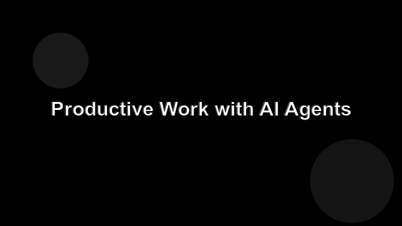

# Welcome to Coffee Brewing Basics

This short course walks through everything you need to brew better coffee at home — without buying a single new gadget.

## What you will learn

- How to pick beans that are actually fresh.
- Why your grind size matters more than your machine.
- The water-to-coffee ratio that makes most home brews better instantly.
- Three common methods and when each one shines.
- How to taste your coffee deliberately and adjust the next brew.

## How to follow along

Read each page in order. The course builds from ingredients to method to feedback. By the end you will have a repeatable process you can tweak rather than guess at.
