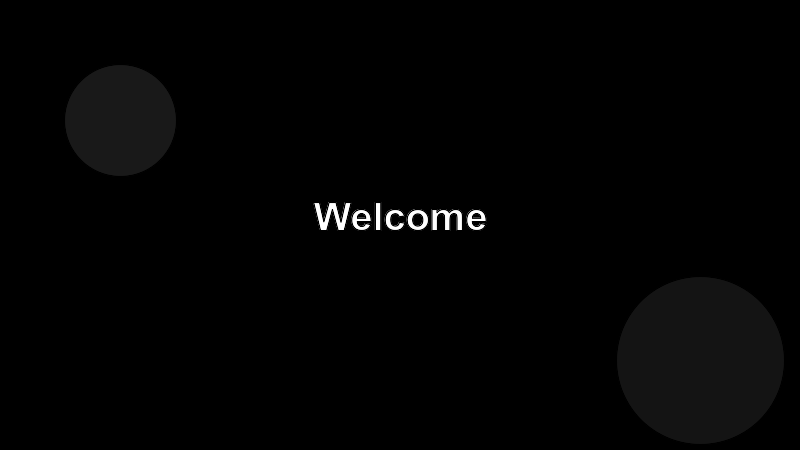

# Welcome to Building an MCP Server

This course walks you through shipping a real Model Context Protocol (MCP) server — the kind of integration that lets an AI agent like Claude Code reach into your systems on the user's behalf.

## What you'll build

By the last page you'll have a small but production-shaped MCP server that:

- exposes a couple of tools the agent can call,
- serves a resource the agent can read,
- ships a slash-command style prompt,
- runs locally, has tests, and plugs into a real client.

## Who this is for

You should be comfortable in one mainstream language (TypeScript or Python is what we'll use), know your way around a terminal, and have used an AI coding assistant at least a few times.

## How to use the course

Each page is short on purpose. Read it, do the small exercise at the bottom, and only then move on.
