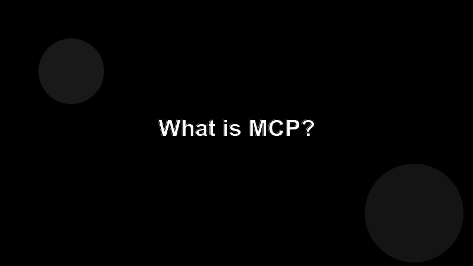

# What is the Model Context Protocol?

The Model Context Protocol (MCP) is an open specification that defines how an AI client talks to an external server to fetch context and trigger actions.

## The one-paragraph version

A client (Claude Code, Claude Desktop, an IDE plugin) opens a connection to a server you wrote. The server advertises three things: **tools** the agent can call, **resources** the agent can read, and **prompts** the user can invoke. The agent decides when to use them; the protocol handles the plumbing.

## Why it matters

Before MCP, every integration was a one-off. You wrote a custom plugin per IDE, per assistant, per workflow. MCP collapses that into one server you write once and reuse everywhere.

## What you don't have to think about

- Transport (stdio, HTTP, WebSocket).
- Message framing.
- Schema negotiation.

The SDK handles those. Your job is to model your domain as tools, resources, and prompts.
