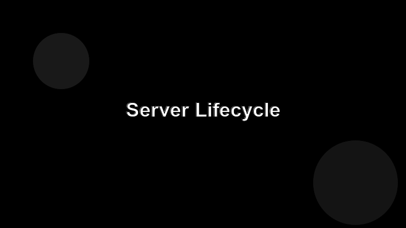

# The Server Lifecycle

Every MCP server, no matter the language, follows the same four-step dance.

## 1. Initialize

The client connects and sends an `initialize` message announcing its capabilities and protocol version. Your server responds with its own capabilities — which of tools, resources, prompts you implement.

## 2. List

The client asks `tools/list`, `resources/list`, and `prompts/list`. The server returns the catalog. This usually happens once per session.

## 3. Call

When the agent decides to use something, it sends `tools/call`, `resources/read`, or `prompts/get`. The server runs the work and returns a result. **This is where most of your code lives.**

## 4. Shut down

The client closes the connection. Clean up open handles, flush logs, exit cleanly.

## Mental model

Think of the server as a library function the agent calls over a wire. The protocol is the calling convention; your handlers are the function bodies.
