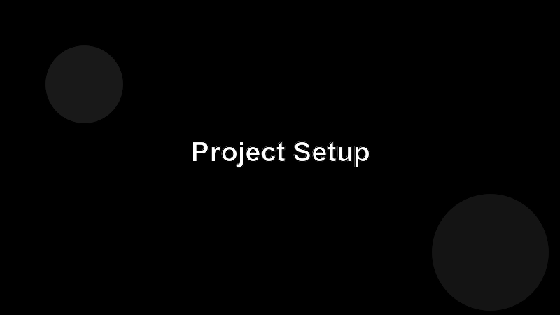

# Project Setup

Time to scaffold the server. We'll use TypeScript and the official `@modelcontextprotocol/sdk` package.



## Initialize the project

```bash
mkdir my-mcp-server && cd my-mcp-server
npm init -y
npm install @modelcontextprotocol/sdk zod
npm install -D typescript tsx @types/node
npx tsc --init
```

## A no-op server in 20 lines

Create `src/index.ts`:

```ts
import { Server } from "@modelcontextprotocol/sdk/server/index.js";
import { StdioServerTransport } from "@modelcontextprotocol/sdk/server/stdio.js";

const server = new Server(
  { name: "my-mcp-server", version: "0.1.0" },
  { capabilities: { tools: {}, resources: {}, prompts: {} } }
);

await server.connect(new StdioServerTransport());
```

Run it with `npx tsx src/index.ts`. The process should sit and wait for stdio input — that's a healthy server doing nothing.

## Exercise

Add a `npm run dev` script that runs `tsx src/index.ts` and confirm it starts cleanly.
