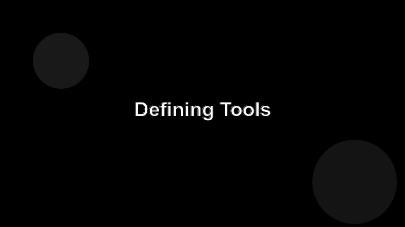

# Defining Tools

Tools are the verbs of your server — actions the agent can decide to call. Each one has a name, a description, an input schema, and a handler.



## A first tool

```ts
import { z } from "zod";

server.tool(
  "echo",
  "Echo back the user's message verbatim.",
  { message: z.string().describe("Text to echo") },
  async ({ message }) => ({
    content: [{ type: "text", text: message }],
  })
);
```

## What the agent sees

The model gets the **name**, the **description**, and the **JSON schema** of the input. That's it. So write descriptions like you're writing API docs for a smart but distracted developer:

- Lead with what the tool does, not how.
- Mention side effects (`writes to disk`, `sends an email`).
- Spell out the units of any number-y argument.

## Side-effect safety

Treat tool calls as production traffic. Validate inputs, set timeouts, and never let an exception in your handler tear down the whole server — return an error result instead.
