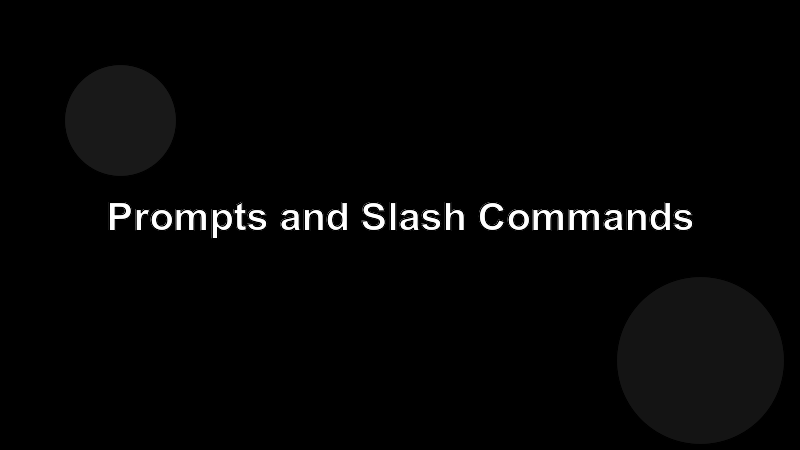

# Prompts and Slash Commands

Prompts are pre-baked, parameterized message templates the user can invoke from the client (in Claude Code: a slash command).



## What a prompt is

A prompt has a name, a description, an optional list of arguments, and a function that returns one or more chat messages. Unlike tools, the prompt produces text the user sends to the model — it doesn't run side-effecting code.

## Sketch

```ts
server.prompt(
  "review-pr",
  "Open the diff and ask the agent to review it.",
  { prNumber: z.string() },
  async ({ prNumber }) => ({
    messages: [{
      role: "user",
      content: { type: "text", text: `Review PR #${prNumber} on origin/main and call out risky changes.` },
    }],
  })
);
```

## Why bother

Prompts are how you encode the **right way to ask** for something. They're version-controlled, shareable across the team, and they keep one-shot work consistent across users.
