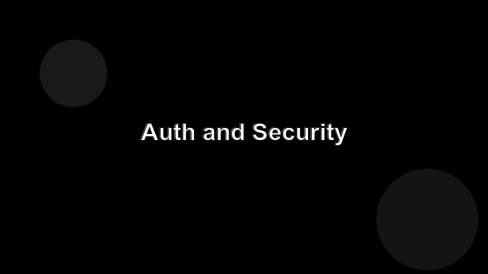

# Authentication and Security

Your server is going to be wired into a process that runs the user's code. Treat that as production from day one.

## Three patterns you'll meet

1. **Local stdio, user-trusted.** The server runs as the user. Permissions are whatever the user has. Lean on the OS for auth.
2. **Local with a remote backend.** The server holds an API token. Store it in the OS keychain or a secret manager, never in `process.env` shipped to the client.
3. **Hosted server, multi-tenant.** Each request needs auth. Use OAuth or signed bearer tokens, and scope every tool to the caller's identity.

## Least privilege

Every tool should require the smallest set of inputs that does the job. If a tool only needs a project id, don't accept a generic SQL string. If it only needs read access, don't open a write transaction.

## Things that will bite you

- Logging request bodies that contain secrets.
- Accepting file paths without normalizing them (`..` traversal).
- Forgetting to time-bound long-running tool calls.
- Trusting hostnames the agent supplies.
