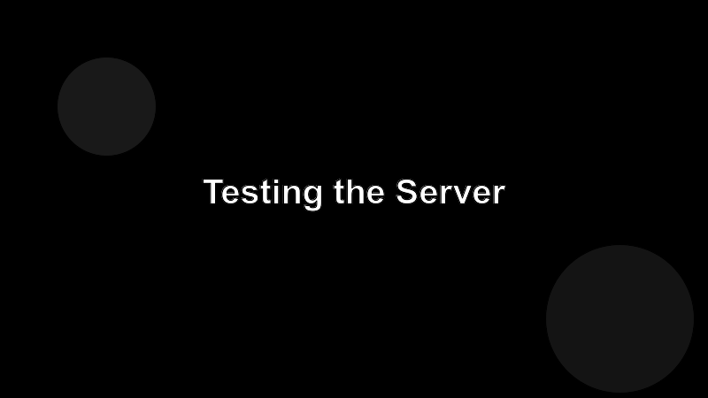

# Testing the Server

You can't open a debugger in the agent's brain, so the only way to know your server behaves is to exercise it the same way the client will.



## The Inspector

The official MCP Inspector is a small web UI that connects to your server, lists its tools and resources, and lets you call them by hand.

```bash
npx @modelcontextprotocol/inspector npx tsx src/index.ts
```

Open the URL it prints. Click each tool. Confirm the input schema looks right and the output is what you'd want a model to reason about.

## Unit tests

Write tests at the **handler** level, not by spawning a subprocess. Most SDKs let you import the handler and call it directly.

```ts
import { describe, it, expect } from "vitest";
import { handleEcho } from "../src/tools/echo.js";

describe("echo", () => {
  it("returns the message", async () => {
    const r = await handleEcho({ message: "hi" });
    expect(r.content[0].text).toBe("hi");
  });
});
```

## End-to-end smoke test

Once a release: launch the real server, connect with the Inspector, and run through a short scripted scenario. Cheap insurance.
