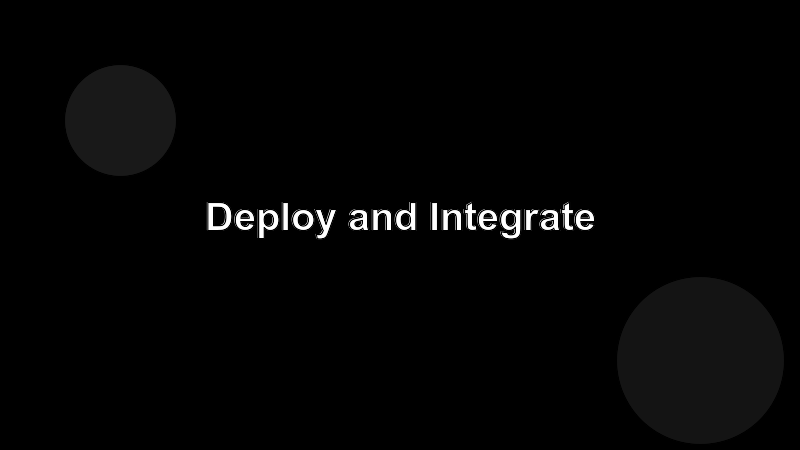

# Deploy and Integrate

Time to move the server out of your dev folder and into the user's workflow.



## Package it

```bash
npm run build           # tsc → dist/
npm publish --access public
```

A published npm package gives the user one canonical way to install: `npx my-mcp-server`. Pin a version in your README and tag releases in git.

## Wire into Claude Code

Add an entry to the user's MCP config:

```json
{
  "mcpServers": {
    "my-mcp-server": {
      "command": "npx",
      "args": ["-y", "my-mcp-server@latest"]
    }
  }
}
```

Restart the client. Run `/mcp` (or the equivalent) and confirm your server shows up with its tools listed.

## What "done" looks like

- The server installs in one command on a clean machine.
- Tools are discoverable, well-described, and idempotent where they can be.
- A new contributor can run the test suite without secrets.
- There's a CHANGELOG and you cut versions on real changes.

## Where to go next

Add observability (structured logs, request ids), throttle expensive tools, and consider a hosted variant if your users aren't all developers.
