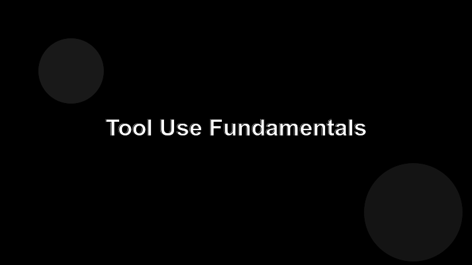

# Tool Use Fundamentals

A model without tools can only talk. With tools it can read your repo, run your tests, and open a PR.



## What a tool actually is

A tool is a named function with a typed input. The agent picks the tool, fills in the arguments, the runtime executes it, and the result goes back into the context.

```jsonc
{ "name": "run_tests", "args": { "path": "src/payments" } }
```

## The cost of a bad tool

Every tool you expose is one more option the model has to weigh. Too many tools, or tools with vague descriptions, and the agent will:

- pick the wrong one,
- pass the wrong arguments,
- or refuse to act at all.

## Rules of thumb

- **One verb, one tool.** `find_users` and `delete_user` separate; not `manage_users`.
- **Describe side effects in the description.** "Writes to disk" beats a docstring nobody reads.
- **Return small, useful results.** A 50KB blob the agent has to re-parse is a tax on every following turn.
