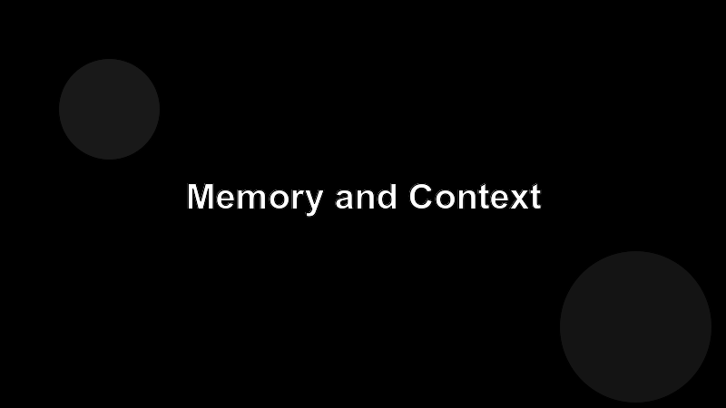

# Memory and Context

The model only sees its context window. Everything else is invisible. So your job is to decide what makes it in.

## Three kinds of "memory"

1. **Conversation history.** Already in context. Free; bounded.
2. **Retrieved memory.** Pulled in on demand from a store you control (files, vectors, a database). Cheap; relevance is your problem.
3. **Persistent memory.** Notes the agent writes for itself across sessions. Powerful; trust them only as much as you trust the writer.

## What deserves to be in context

- Files the agent is editing, in full.
- The current goal and constraints, restated tersely.
- The last few decisions and why.

## What doesn't

- Whole codebases when the task touches one module.
- Logs the agent will never read.
- Verbose tool output that's mostly noise.

## A useful habit

When a session gets long, ask the agent to **summarize the state** in one paragraph. Use the summary as the seed for the next session. You'll be surprised how often that's enough.
