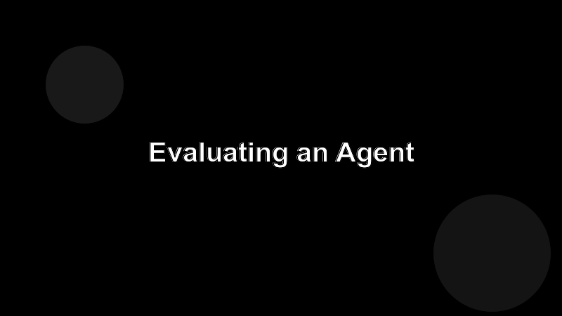

# Evaluating an Agent

Without measurement, every prompt change feels like progress. With measurement, half of them turn out to be regressions.

## Levels of evaluation

1. **Smoke tests.** A handful of fixed scenarios you run by hand after a change. Catches catastrophes.
2. **Eval set.** Twenty to a few hundred curated tasks with expected outcomes (or graders). Run them in CI on every prompt or model change.
3. **Production telemetry.** What real users do, with consent. Slowest signal, but the only one that's honest.

## Build the eval set first

You can't tune what you can't measure. Before you ship a prompt change, write three scenarios it should improve and three it shouldn't break. That's a usable eval, even if it's tiny.

## What to track

- Pass rate on the eval set.
- Average turns to completion.
- Cost per task (tokens × price).
- Human override rate, if you have humans in the loop.

## Watch for the cost-quality slide

A change can lift pass rate by burning more tokens. Track both. The goal is more passes per dollar, not more passes at any price.
