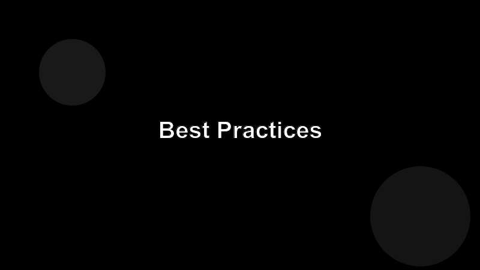

# Best Practices

A short list of habits that compound. None are surprising; the trick is doing them every day.

## Habits

- **Brief, then step back.** Write a tight goal-and-constraints brief, hand off, and don't micromanage the first attempt.
- **Small commits.** One agent turn → one diff → one review. Big agent commits hide bugs and resist rollback.
- **Tight loops.** Tests, lints, type checks should run in seconds. The faster the agent can self-correct, the less you have to.
- **Honest reviews.** Read the diff. The output looks plausible by default; that's exactly what makes it dangerous.
- **One source of truth.** When the prompt, the tool docs, and the code disagree, the code wins. Update the others.
- **Capture lessons.** When you correct the agent on something it'll see again, write the rule down where the next session will read it.

## Anti-patterns

- Asking the agent to "make it production-ready" without saying what that means.
- Accepting a green test suite as proof of correctness without reading the tests.
- Running an agent unattended on a goal you wouldn't trust a junior with unattended.

## The shortest version

Treat the agent like a fast, tireless, slightly overconfident teammate. You're still the engineer.
