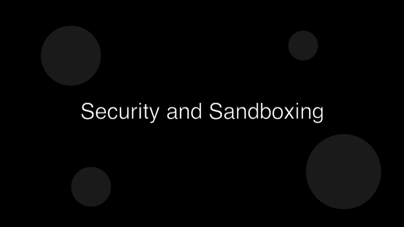

# Shipping to Production

Building an agent that works on your laptop is the easy half. Putting it in front of users — or in a CI loop, or behind a webhook — is where most projects quietly stall. The work isn't dramatic; it's a checklist.

## What "ready" actually means

A demo is ready when it works once. Production is ready when it works boringly, and the failures are someone's job to see. Three loose criteria:

1. **You have a number.** A success rate, a latency budget, a cost ceiling — pick what matters and write it down. Not "feels fast"; a percentile.
2. **You have a rollback.** A flag, a previous prompt version, a previous model id. Something one person can flip in one minute.
3. **You have an owner.** One person who pages when the agent breaks. Without one, failures stack up and nobody notices until it's too painful to fix.

## Pre-flight checks

Before the first real user hits it:

- **Cap the spend.** A per-request token cap, a per-day total cap, a per-tenant cap. Agents loop. Loops cost money. The first time someone leaves an agent unattended in a tight retry, the bill explains everything.
- **Cap the blast radius.** No write tools the agent doesn't strictly need. No prod credentials in dev runs. No file system access wider than the working directory.
- **Version everything that affects behavior.** Prompt, tool list, model id, system instructions. Keep them in source control. When something regresses, the diff tells you what to suspect.

## After launch

- **Watch the percentiles, not the average.** A handful of slow runs hide behind a fine mean. p95 latency, p95 cost, p95 retry count — those tell you whether the long tail is getting worse.
- **Replay failed sessions.** Capture full traces (input, tool calls, outputs) for failed runs. Re-running a failure with the same prompt + context is the fastest way to tell if a fix really fixes it.
- **Iterate the brief, not the model.** Most regressions trace back to a prompt or tool change, not a model change. When something goes wrong, suspect the words you wrote first.

## A closing rule

Production agents look the most like a product when they look the least like an experiment. Boring logs, predictable costs, a person on call, a rollback that works. Ship that, and let the surprise come from what the agent helps you do — not from how it breaks.
