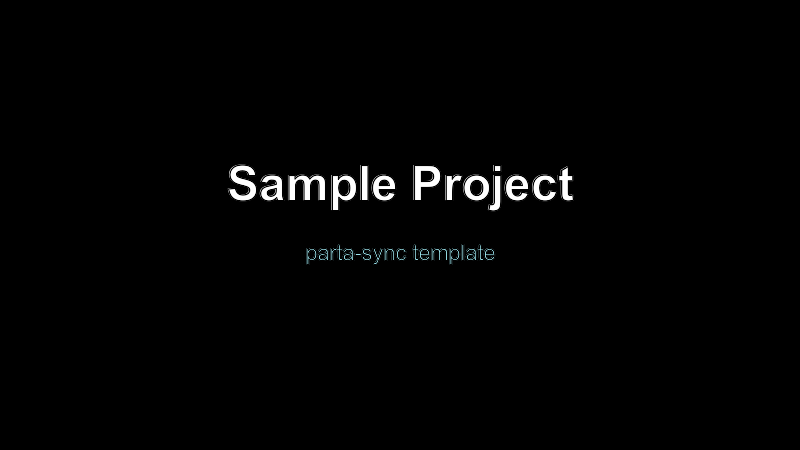

# Welcome to the Sample Project

This is a minimal template that mirrors the structure expected by the `parta-sync` skill.

## What you get

- A `project.json` describing the course shell (id, companyId, name, description, ordered pages).
- A `pages/` directory with one Markdown file per page, referenced from `project.json`.
- An `assets/` directory for images, videos, and other binary files used inside pages.
- A `.sync.json` file (created on first sync) that records what was last pushed to Parta.

Use this folder as a copy-paste starting point for any new course.
