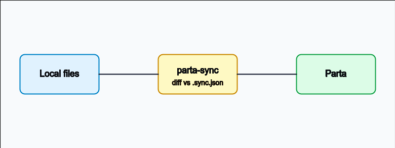

# Getting Started

The `parta-sync` skill watches this directory for changes and pushes the delta to Parta.

## Workflow

1. Edit a page in `pages/` or drop a new image into `assets/`.
2. Run the `parta-sync` skill (or wait for the scheduled run).
3. The skill diffs the working tree against `.sync.json` and updates only what changed in Parta.

## Key rules

- Page **order** in `project.json` is the source of truth. Reordering triggers section moves.
- A page rename keeps its identity if the `ref` path stays the same.
- Renaming `ref` is treated as delete + create — avoid it unless the page is genuinely new.
